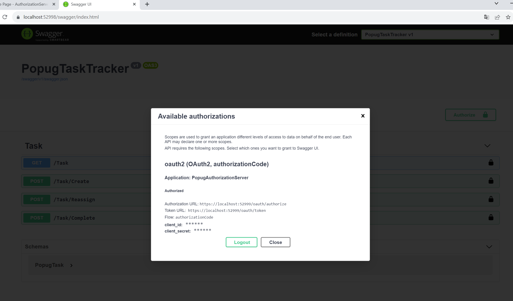
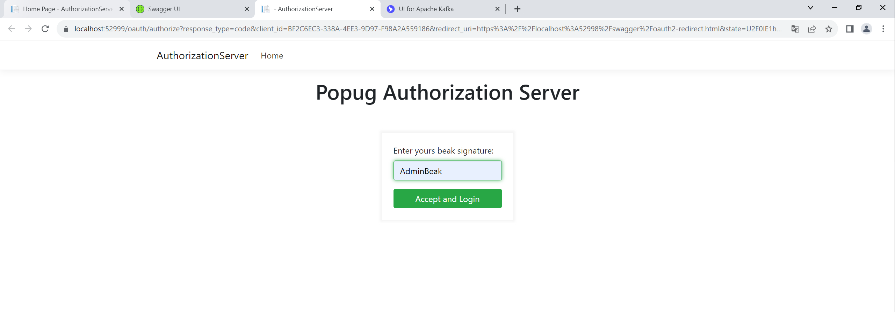

# 2024 03 02
Реализовано 2 сервиса. Сервис авторизации (PopugAuthorizationServer) и сервис заданий (PopugTaskTracker).
Стэк - .NET 5.0, SQLLite, Kafka, Docker, Razor Pages для формы логина. Интерфейсов нет, кроме ввода клюва, в качестве интерфейсов swagger ui :)

Проекты:
-
**PopugCommon** - общая библиотека, для все проектов, содержит helper-ы для авторизации, работы с kafka, а так же контракты (схемы сообщений).
**PopugAuthorizationServer** - сервис авторизации oAuth 2.0, с интерфейсом для ввода сигнатуры клюва и предоставляющий методы для админов добавления, редактирования и удаления пользователей.
-- контроллер  oAuth - методы для авторизации по oAuth 2.0
-- контроллер User - методы для администраторов
-- в качестве модели данных внутри сервиса AspCore Identity
-- формирует 3 CUD события (добавление, обновление и удаление пользователя) в topic users-stream пример 

```JSON
{
	"MessageId": "be2571a7-f594-4d7d-969a-b7f8bb6c6735",
	"OpertionDate": "2024-03-02T09:18:48.1706555+00:00",
	"Operation": 1,
	"Value": {
		"UserId": "f9356a25-f612-40af-b48f-4e79a9cfeb04",
		"UserName": "Admin",
		"UserRole": "Admin"
	}
}
```
**PopugTaskTraker** - сервис трэкинга предоставляет пользователям методы для работы с задачами, авторизация oAuth через сервис авторизации Попугов
Контроллер Task позволяет 
--попугу с любой ролью создать и выполнить задачу 
--попугам с ролями Admin и Manager возможность переассайнить задачи, 

Список попугов пополняется, обновляется и удаляется из users-stream topic-а сервиса авторизации и сохраняются в базу

Сервис формирует CUD события в topic tasks-stream изменения Task-а, например добавление задачи
```JSON
{
	"MessageId": "d6329fd6-1342-4dbe-8c9c-091fa864c6a3",
	"OpertionDate": "2024-03-02T09:32:40.2114916+00:00",
	"Operation": 1,
	"Value": {
		"Id": 1,
		"Description": "Задание для попуга",
		"IsCompleted": false,
		"AssignedUserId": "bd3c67e1-5fdb-4c71-8025-ae4a40413dec"
	}
}
```
Так же формируются бизнес события TaskAssigned и TaskCompleted в топике tasks-events, например попуг добавлен. Именования событий пока в enum, в следующем уроке поправлю контракты.
```JSON
{
	"MessageId": "f82f8a8b-5c46-402c-92c3-be22e140549a",
	"OpertionDate": "2024-03-02T09:32:42.3490935+00:00",
	"Event": 1,
	"Value": {
		"Id": 1,
		"Description": "Задание для попуга",
		"IsCompleted": false,
		"AssignedUserId": "bd3c67e1-5fdb-4c71-8025-ae4a40413dec"
	}
}
```
На текущий момент CUD события по количеству соответствуют бизнес события, т.к. каждое из действий пользователя приводит к изменению данных.

**Quick start**

- Все поднимает через docker-compose.yml
- Сервис авторизации https://localhost:52999/
- Swagger для работы с пользователями https://localhost:52999/swagger/index.html
- Swagger для работы с тасками https://localhost:52998/swagger/index.html
- В swagger подключена oAuth авторизация через PupogAuthorization сервис






